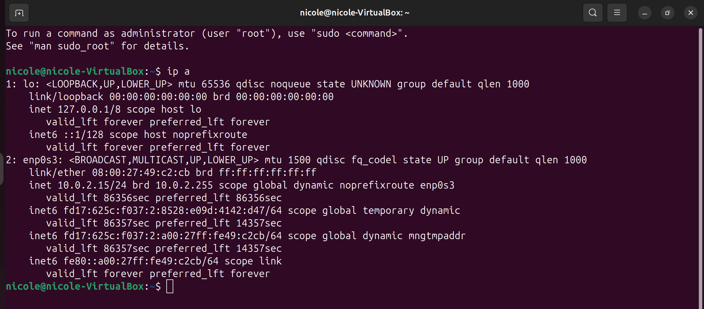
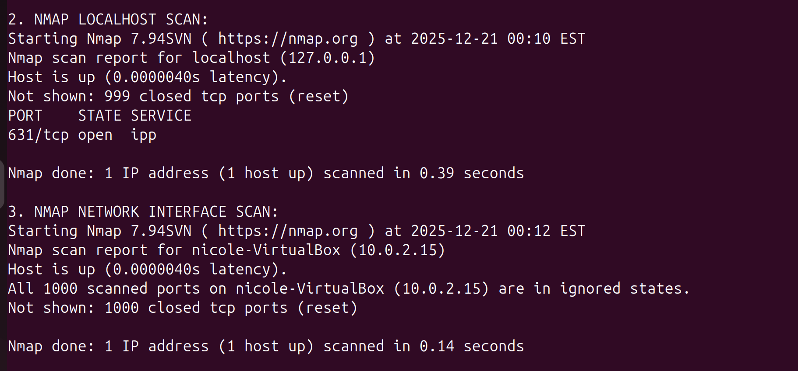
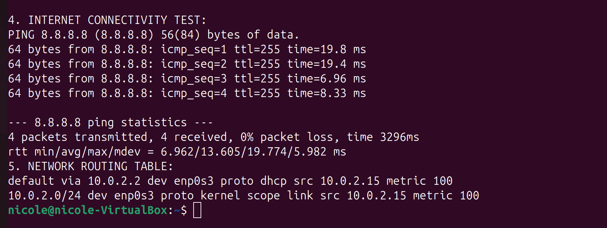

# IT-Home-Labs
Hands on IT projects demonstrating skills in Linux administration, networking, and system configuration for CompTIA A+ certification and entry level IT roles.

#Project 1: Network Analysis & Security Lab
*Objective: Configure Ubuntu VM and perform network security assessment

**Skills Demonstrated** 
- Virtual machine setup in VirtualBox
- Linux command line proficiency
- Network configuration (`ip`, `route`, `ping`)
- Security scanning with `nmap`
- Network troubleshooting and documentation

**Key Commands Used**
-bash

#Network configuration analysis
ip a
ip route show

#Security assessment 
sudo nmap 127.0.0.1
sudo nmap 10.0.2.15

#Connectivity testing
ping 8.8.8.8

#Results Summary
- Successfully configured NAT networking on Ubuntu VM
- Identified only essential services running (port 631 locally)
- All external ports closed - secure configuration
- 100% internet connectivity with low latency
- Documented complete network configuration

**Evidence**
1. Network Configuration

*Output of 'ip a' command showing network interfaces and IP addresses*

2. Security Scan Results

*Nmap scan showing open ports and security assessment*

3. Connectivity Test

*Successful ping to Google DNS (8.8.8.8) proving network connectivity*
